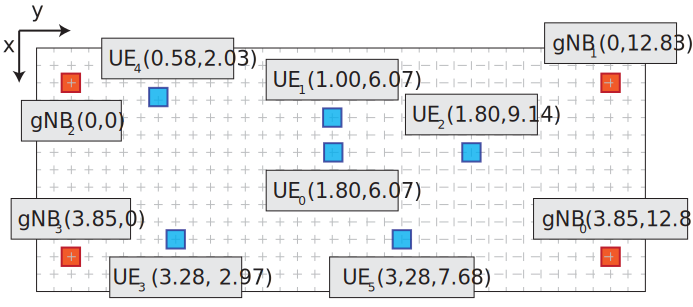

# Location Estimation Experiment Data

## Structure

This repository contains data from location estimation experiments, including Time of Arrival (TOA) measurements, network configurations, and Channel Impulse Response (CIR) captures.

### Experiments Directory

- The **experiments** directory contains TOA measurements with UE (User Equipment) at 6 different positions, with 3 different bandwidths, without oversampling.

### Oversampling Directory

- The **oversampling** directory contains TOA measurements with UE at 2 different positions (0 and 4) but with varying levels of oversampling (up to x16 in some cases!).

### CIR Directory

- The **cir** directory contains TOA measurements and related raw CIR captures.

### Notebooks Directory

- The **analysis** and **results** of the experiments are located here, together with the code to generate the figures.

- For the SciencePlots package, you need to install a custom version located [here](https://github.com/yagoliz/SciencePlots/tree/master). You can install it with this command:

```bash
pip install git+https://github.com/yagoliz/SciencePlots.git
```

## Network Configuration

### UE Positions

- UE 0: [1.8, 6.07]
- UE 1: [1, 6.07]
- UE 2: [1.8, 9.14]
- UE 3: [3.28, 2.97]
- UE 4: [0.58, 2.03]
- UE 5: [5.28, 7.68]

### gNB Positions

- gNB 0: [3.87, 12.81]
- gNB 1: [0, 12.81]
- gNB 2: [0, 0]
- gNB 3: [3.84, 0]




### Bandwidth Configurations

#### 40 MHz

- Band: n78
- SCS (Sub-Carrier Spacing): 30 kHz
- Sampling Rate: 61.44 MSps
- TX/RX Frequency: 3.31968 GHz

#### 80 MHz

- Band: n78
- SCS: 30 kHz
- Sampling Rate: 92.16 MSps
- TX/RX Frequency: 3.3393 GHz

#### 100 MHz

- Band: n77
- SCS: 30 kHz
- Sampling Rate: 122.88 MSps
- TX/RX Frequency: 3.94974 GHz

## Experiments

Experiments 0 to 5 refer to five different network configurations with a fixed Base Station (BS) and five different UE positions.

**NB**:
- For each UE position/experiment, there are multiple TOA measurements at 40/80/100 MHz bandwidth.
- Example: `exp2_100mhz_0` represents UE position 2, 100 MHz BW, first measurement campaign.
- Measurements from different campaigns can be merged.

- 80 MHz was relatively unstable, leading to a few subframes with all 4 ToA measurements of the 4 gNBs.

**TOA Measurement Example**:

```
[2023-09-28 16:51:52.173629] [gNB 0][rsc 0][Rx 0][sfn 645][slot 2] DL PRS ToA ==> -13.0 / 4096 samples, peak channel power -53.9 dBm, SNR -2622080.2 dB, rsrp -77.4 dBm

[2023-09-28 16:51:52.174025] [gNB 1][rsc 0][Rx 0][sfn 645][slot 3] DL PRS ToA ==> -13.0 / 4096 samples, peak channel power -56.8 dBm, SNR -2622080.2 dB, rsrp -78.4 dBm

[2023-09-28 16:51:52.174495] [gNB 2][rsc 0][Rx 0][sfn 645][slot 4] DL PRS ToA ==> -10.0 / 4096 samples, peak channel power -56.6 dBm, SNR -2622080.2 dB, rsrp -83.1 dBm

[2023-09-28 16:51:52.174912] [gNB 3][rsc 0][Rx 0][sfn 645][slot 5] DL PRS ToA ==> -11.0 / 4096 samples, peak channel power -59.0 dBm, SNR -2622080.2 dB, rsrp -84.7 dBm
```


- Consider ToA measurements of the same subframe (sfn).
- Do not consider ToA measurements with "peak channel power" equal to "-inf" dBm.

## Oversampling

The `oversampling` directory contains TOA measurement estimations with specified levels of oversampling (1/2/4/8/16).

**NB**:
- Higher oversampling leads to higher instability and fewer subframes with multiple ToA measurements of the gNBs.

## CIR

The `cir` directory contains CIR raw files that need to be processed using the OAI script. You can find the script [here](https://gitlab.eurecom.fr/oai/openairinterface5g/-/blob/develop/doc/RUN_NR_PRS.md?ref_type=heads#using-matlaboctave-script-to-visualize-prs-channel-estimates).

## Ideas for Analysis

1. Show the improvement in location estimation accuracy by using larger bandwidth.
2. Demonstrate location estimation accuracy improvement by fixing bandwidth to 100 MHz (more stable) and increasing the number of gNBs from 3 to 4.
3. Explore the impact of oversampling on location/TDOA (Time Difference of Arrival) estimation accuracy, comparing the same bandwidth with higher oversampling and small bandwidth (40 MHz) with oversampling versus large bandwidth (100 MHz) without oversampling.


